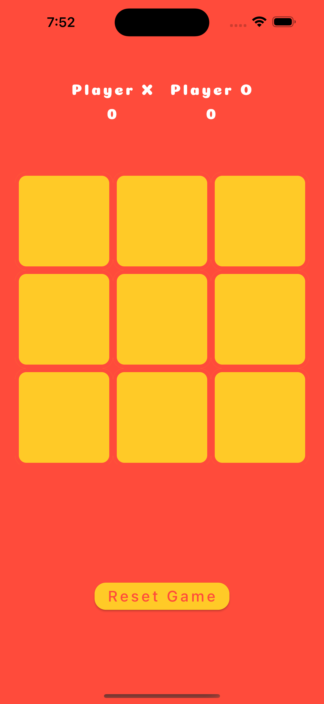

<br/>
<p align="center">

  <h3 align="center">Tic-tac-toe with Flutter</h3>

</p>

      

## About The Project



A simple tic tac toe game in Flutter.

## Built With

ToDo app was built primarily using Flutter, a powerful UI toolkit for building natively compiled mobile, web, and desktop applications. With Flutter, you created a beautiful and functional user interface that works seamlessly across multiple platforms.

* [Flutter 2.2.0](https://flutter.dev/)
* [Dart 2.13.0](https://dart.dev/)
* [Google Fonts](https://pub.dev/packages/google_fonts)


## Getting Started

This is an example of how you may give instructions on setting up your project locally.
To get a local copy up and running follow these simple example steps.

### Installation

1. Clone the repo

```sh
    git clone https://github.com/savaf/flutter_tic_tac_toe.git
```
2. Navigate to the project directory
```sh
    cd flutter_tic_tac_toe
```
3. Install dependencies

```sh
    flutter pub get
```

4. Run the application

```sh
    flutter run
```

## Roadmap

See the [open issues](https://github.com/savaf/flutter_tic_tac_toe/issues) for a list of proposed features (and known issues).


## License

Distributed under the MIT License. See [LICENSE](https://github.com/savaf/flutter_tic_tac_toe/blob/main/LICENSE.md) for more information.
